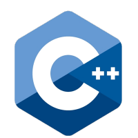

# learn C++

My journey into C++

## [top10](https://github.com/andrewrgarcia/learn-cpp/tree/main/top10)

From [Top 10 algorithms in Interview Questions by Geeks for Geeks](https://www.geeksforgeeks.org/top-10-algorithms-in-interview-questions/). My comments on the `.cpp` files are in ALL CAPS. I May have deleted or edited some comments from GFG for my better understanding.

## [google](https://github.com/andrewrgarcia/learn-cpp/tree/main/google)

Exercises from [Google for Education: C++](https://developers.google.com/edu/c++) site. Some worked-out problems.

## [hackerrank](https://github.com/andrewrgarcia/learn-cpp/tree/main/hackerrank)

Basic but interesting / valuable C++ worked-out exercises for problems from [HackerRank](https://www.hackerrank.com/)

## [structures](https://github.com/andrewrgarcia/learn-cpp/tree/main/structures)

Code for C++ data structures. Most of these developed by me.

## [\_\_secondary](https://github.com/andrewrgarcia/learn-cpp/tree/main/__secondary)

- absolute-beginner

- dev-to

- ou
